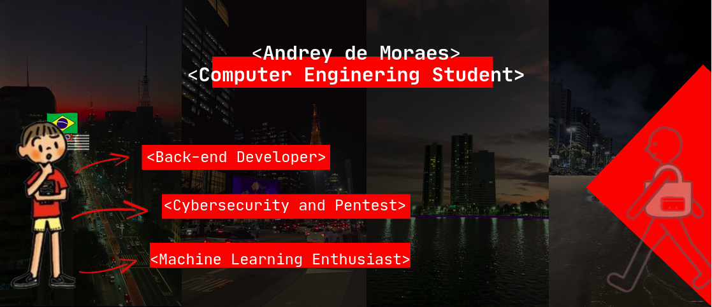

---

Hello! I'm a **Computer Engineering Student** at **UNIVESP** , São Paulo, Brazil.

I’m passionate about technology and have been learning topics such as  **Python** ,  **Ethical Hacking** ,  **Cybersecurity & Pentesting** , and **Machine Learning.**

I use Linux every day. I started with  **Linux Mint** , then moved to  **Fedora** , and now I’m running **Arch Linux** as my main system. For cybersecurity projects, I work with **Kali Linux** in a virtual machine.

In **Machine Learning**, I’ve been studying and building projects using Python.

---

---

# CYBERSECURITY

* HTTP-SECURITY-AI:[ https://github.com/andreymsdev/http-security-ai
  ](https://github.com/andreymsdev/http-security-ai)
* KEYLOGGER-WITH-PYTHON:[ https://github.com/andreymsdev/Keylogger-in-Python-with-GUI](https://github.com/andreymsdev/Keylogger-in-Python-with-GUI)
* PDF-METADATA:[ https://github.com/andreymsdev/LOOKING-FOR-AND-DELETING-PDF-METADATA-READER](https://github.com/andreymsdev/LOOKING-FOR-AND-DELETING-PDF-METADATA-READER)

---

# MACHINE LEARNING

* DETECTOR-DE-LIBRAS: https://github.com/andreymsdev/Detector-de-Libras
* EXPRESSÕES COM MACHINE LEARNING: https://github.com/andreymsdev/expressoes-com-machine-learning

---

# AI
* N8N-PDF-GENERATOR: https://github.com/andreymsdev/n8n-pdf-generator-with-ia

  
  
  
  

---
